<picture>
  <source media="(prefers-color-scheme: dark)" srcset="./dark.svg">
  <source media="(prefers-color-scheme: light)" srcset="./light.svg">
  
</picture>

## Hola, soy Bryan

Por aquí me conocen como **Stack**. Estudio **Ingeniería Civil Informática** en
Chile y uso **Arch Linux**.

Mi nick viene de la mejor estructura de datos: **la pila**. *Last in, first out.*

### Un poco más

Código, música y demasiados videojuegos.
