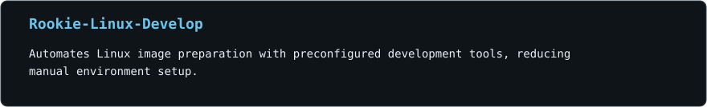
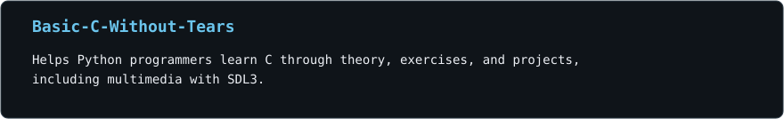
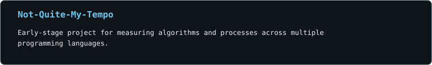
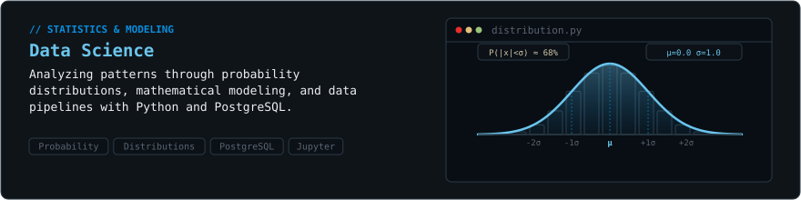

<!-- Generated by scripts/build_profile.py. Edit config/, content/, or templates/README.md.tpl. -->

<picture>
  <source media="(prefers-reduced-motion: reduce) and (max-width: 600px)" srcset="assets/terminal-mobile-static.svg">
  <source media="(prefers-reduced-motion: reduce)" srcset="assets/terminal-static.svg">
  <source media="(max-width: 600px)" srcset="assets/terminal-mobile.svg">
  
</picture>

---

## Contact

     

---

## About Me

I'm a Computer Engineering student with a passion for teaching. I enjoy teaching math and computer science, always guided by the philosophy that the best way to learn is by teaching. I love programming, although with AI around, I don't do it as much anymore XD. I like designing systems and tools for various topics, and I'm obsessed with customization because I use Arch, btw.

AFK, I'm a musician and play several instruments. I definitely have more hours logged in video games than touching grass. I also love playing basketball because you have to move your ass every once in a while, and I'm a bit of an alcoholic, but what engineer isn't?

---

## Tech Stack

**Languages**

     

**Environment &amp; OS**

  

**Frameworks &amp; Tools**

     

**Databases**

 

---

## Featured Projects

<a href="https://github.com/StackDs/Rookie-Linux-Develop">
  <picture>
    <source media="(max-width: 600px)" srcset="assets/project-01-mobile.svg">
    
  </picture>
</a>

<a href="https://github.com/StackDs/Basic-C-Without-Tears">
  <picture>
    <source media="(max-width: 600px)" srcset="assets/project-02-mobile.svg">
    
  </picture>
</a>

<a href="https://github.com/StackDs/Not-Quite-My-Tempo">
  <picture>
    <source media="(max-width: 600px)" srcset="assets/project-03-mobile.svg">
    
  </picture>
</a>

---

## Activity & Contributions

<picture>
  <source media="(prefers-color-scheme: dark)" srcset="assets/contributions/snake-dark.svg">
  
</picture>

I'm trying to improve this, so... KISS. Keep it simple, stupid.

---

## About My Interests

<picture>
  <source media="(prefers-reduced-motion: reduce) and (max-width: 600px)" srcset="assets/interest-programming-mobile-static.svg">
  <source media="(prefers-reduced-motion: reduce)" srcset="assets/interest-programming-static.svg">
  <source media="(max-width: 600px)" srcset="assets/interest-programming-mobile.svg">
  
</picture>

<picture>
  <source media="(prefers-reduced-motion: reduce) and (max-width: 600px)" srcset="assets/interest-algorithms-mobile-static.svg">
  <source media="(prefers-reduced-motion: reduce)" srcset="assets/interest-algorithms-static.svg">
  <source media="(max-width: 600px)" srcset="assets/interest-algorithms-mobile.svg">
  
</picture>

<picture>
  <source media="(prefers-reduced-motion: reduce) and (max-width: 600px)" srcset="assets/interest-data_science-mobile-static.svg">
  <source media="(prefers-reduced-motion: reduce)" srcset="assets/interest-data_science-static.svg">
  <source media="(max-width: 600px)" srcset="assets/interest-data_science-mobile.svg">
  
</picture>

---

## Hall of Fame

<picture>
  <source media="(prefers-reduced-motion: reduce) and (max-width: 600px)" srcset="assets/quotes-mobile-static.svg">
  <source media="(prefers-reduced-motion: reduce)" srcset="assets/quotes-static.svg">
  <source media="(max-width: 600px)" srcset="assets/quotes-mobile.svg">
  
</picture>
