<!-- Generated by scripts/build_profile.py. Edit config/, content/, or templates/README.md.tpl. -->

<picture>
  <source media="(prefers-reduced-motion: reduce) and (max-width: 600px)" srcset="assets/terminal-mobile-static.svg">
  <source media="(prefers-reduced-motion: reduce)" srcset="assets/terminal-static.svg">
  <source media="(max-width: 600px)" srcset="assets/terminal-mobile.svg">
  
</picture>

[Instagram](https://www.instagram.com/_bryan.712/) · [PSN Profiles](https://psnprofiles.com/StackDS) · [LinkedIn](https://www.linkedin.com/in/bryan-aguirre-fuentes-1953642bb/) · [Email](mailto:stackctrlz@gmail.com)

## About Me

I'm a Computer Engineering student who enjoys teaching mathematics and programming. My philosophy is simple: **the best way to learn something is to teach it.**

I enjoy building custom tools and automating repetitive work. I'm especially interested in assessment platforms, programming judges, and development environments tailored to the people using them.

Away from the keyboard, I play **guitar and bass**. I also make time for video games, basketball, and an arguably unreasonable amount of Arch Linux customization.

## Tech Stack

**Languages**

[](https://en.cppreference.com/w/c) [](https://isocpp.org/) [](https://www.python.org/) [](https://dev.java/)

**Environment &amp; OS**

[](https://archlinux.org/) [](https://www.gnu.org/software/bash/) [](https://www.docker.com/)

**Libraries &amp; Tools**

[](https://wiki.libsdl.org/SDL3/FrontPage) [](https://www.latex-project.org/) [](https://git-scm.com/)

**Databases**

[](https://www.postgresql.org/)

## Featured Projects

| Project | What it solves |
| --- | --- |
| [Rookie-Linux-Develop](https://github.com/StackDs/Rookie-Linux-Develop) | Automates Linux image preparation with preconfigured development tools, reducing manual environment setup. |
| [Basic-C-Without-Tears](https://github.com/StackDs/Basic-C-Without-Tears) | Helps Python programmers learn C through theory, exercises, and projects, including multimedia with SDL3. |
| [Not-Quite-My-Tempo](https://github.com/StackDs/Not-Quite-My-Tempo) | Early-stage project for measuring algorithms and processes across multiple programming languages. |

## Activity & Contributions

<picture>
  <source media="(prefers-reduced-motion: reduce) and (prefers-color-scheme: dark)" srcset="assets/contributions/snake-dark-static.svg">
  <source media="(prefers-reduced-motion: reduce)" srcset="assets/contributions/snake-static.svg">
  <source media="(prefers-color-scheme: dark)" srcset="assets/contributions/snake-dark.svg">
  
</picture>

[](https://github.com/StackDs)

Commit year is shown on the card; rank and PR totals are reported by GitHub Readme Stats. Updated daily when the provider is available.

## Hall of Fame

<details>
<summary>💬 View intercepted transmissions — Quotes</summary>

> "I'm the son of rage and love" — *St. Jimmy*

> "You can't get a hangover if you don't stop drinking" — *Lemmy Kilmister*

> "Talk is cheap. Show me the code" — *Linus Torvalds*

> "A wrong decision is better than indecision" — *Tony Soprano*

> "Yeah, Mr. White\! Yeah, science\!" — *Jesse Pinkman*

> "Wubba lubba dub dub\!" — *Rick Sanchez*

> "What's in the box?" — *Se7en*

> "Cadia stands, and we shall not fall" — *Imperial Creed*

> "War. War never changes." — *Fallout*

> "Forget about Freeman" — *Half-Life*

> "The cake is a lie" — *Portal*

> "Praise the sun\!" — *Solaire of Astora*

> "Would you kindly?" — *Atlas*

> "How's your sister?" — *Cayde-6*

> "In a world without gold, we might've been heroes" — *Blackbeard*

> "SIC PARVIS MAGNA" — *Sir Francis Drake*

> "Kept you waiting, huh?" — *Big Boss*

> "It can't be for nothing" — *Ellie*

</details>

## Code Philosophy

```c
if (opening_brace_on_same_line) {
    respect++;
}
```

*Last in, first out.*
